# Student Computer Provisioning

### Prep: You will need...
- Make sure your computer is plugged in and your wifi is stable
- You will need your computer password

### General Info
- The process will take about an hour depending on your internet speed
- This will install:
  - Google Chrome
  - Slack
  - Atom
  - VS Code
  - Zoom
  - As well as a handful of other apps and technology we will use in class

### Step 1: Search for the terminal app
- `command + space bar` will give you the spotlight search
- Type in `terminal`
- Drag the terminal app into the dock for quick reference
- The terminal icon is a little black square

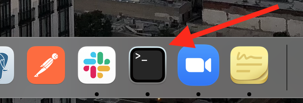

- Open terminal

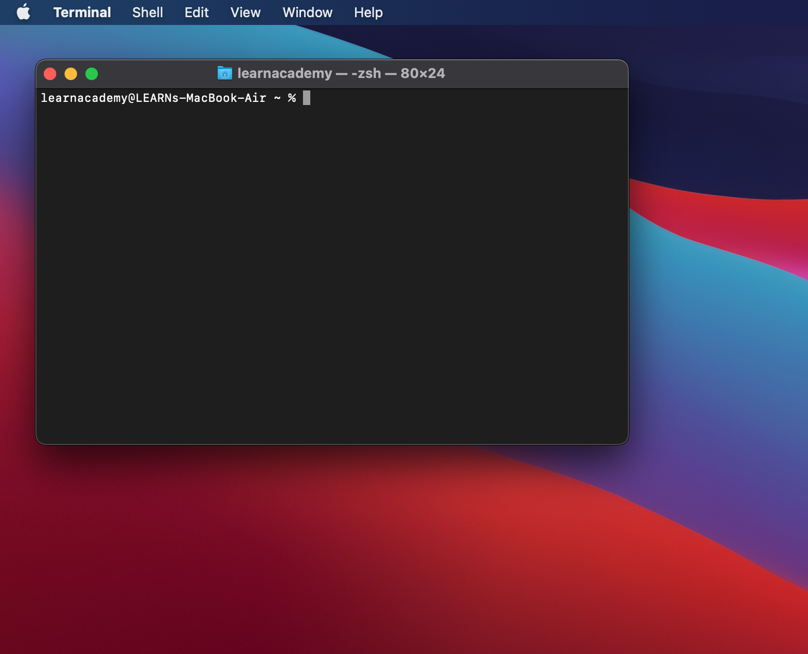

---
### Step 2: Install Homebrew
- Homebrew is a Mac package manager
- Search in the web browser for `homebrew`
- It will likely be the first search result

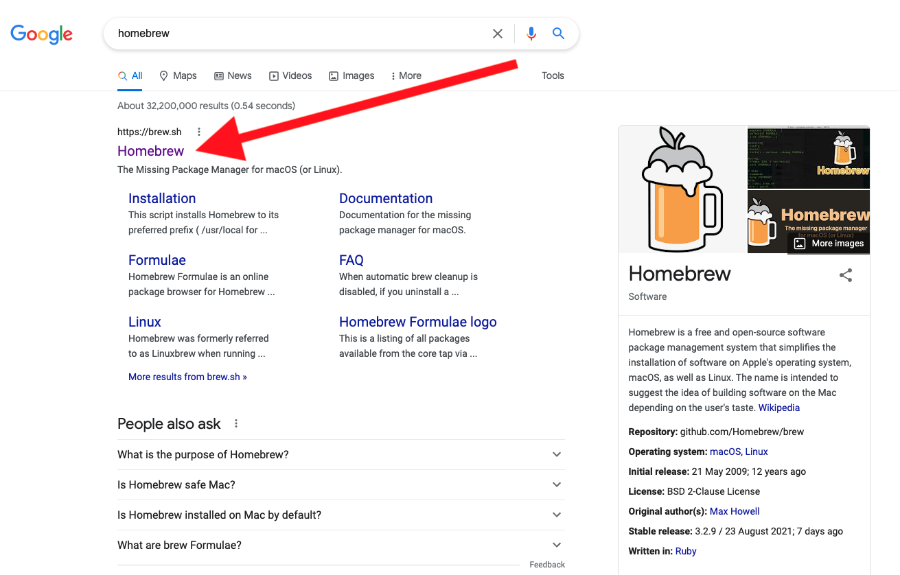

- Open the homebrew homepage
- Click the clipboard icon to copy the install command

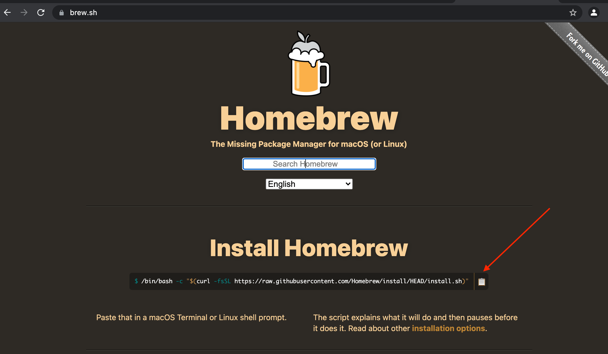

- Paste (shortcut - `command + v`) the install command in terminal
- Hit return
- The command will ask for the computer password
- When you type **no characters will appear** to protect your password, but the keystrokes will be logged

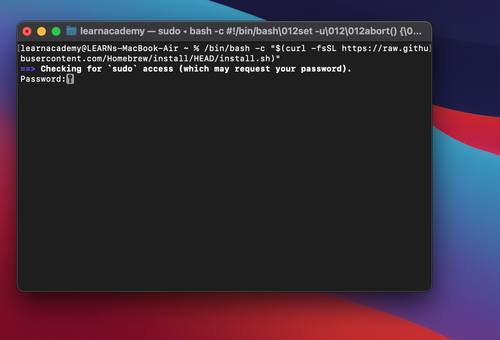

- Hit return to continue and follow any additional prompts from Homebrew
- This command can take around 20 min to install
  - Sometimes it will look like the computer is not doing anything, that is okay!
- When the install command is finished your terminal will look like this:

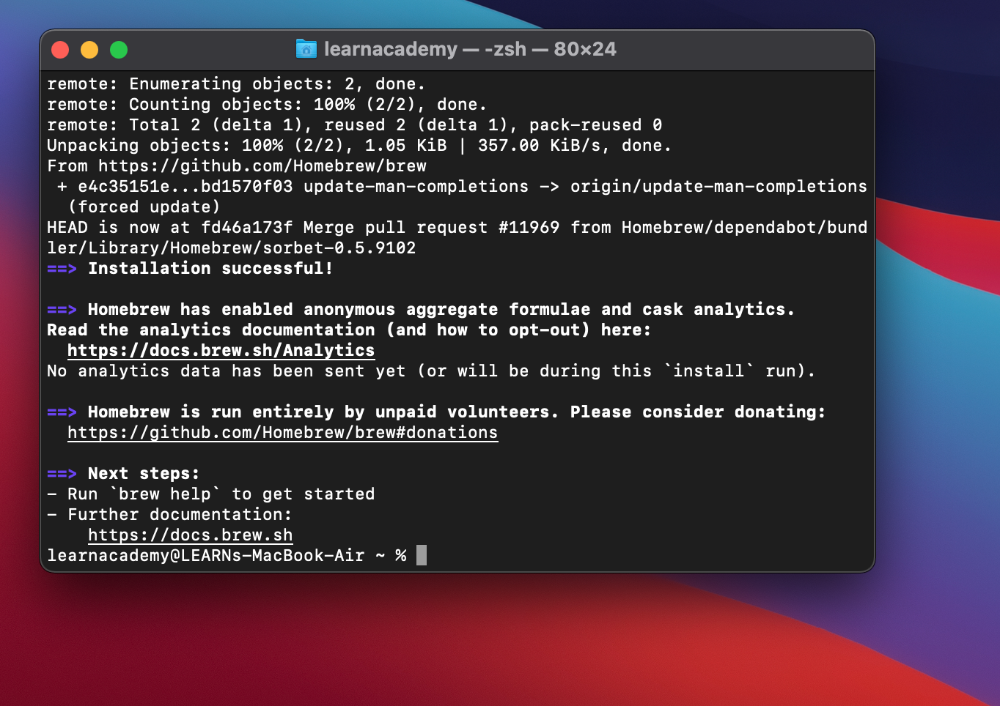

---
### Step 3: Install Git
- In terminal type the command `brew install git`
- Hit return

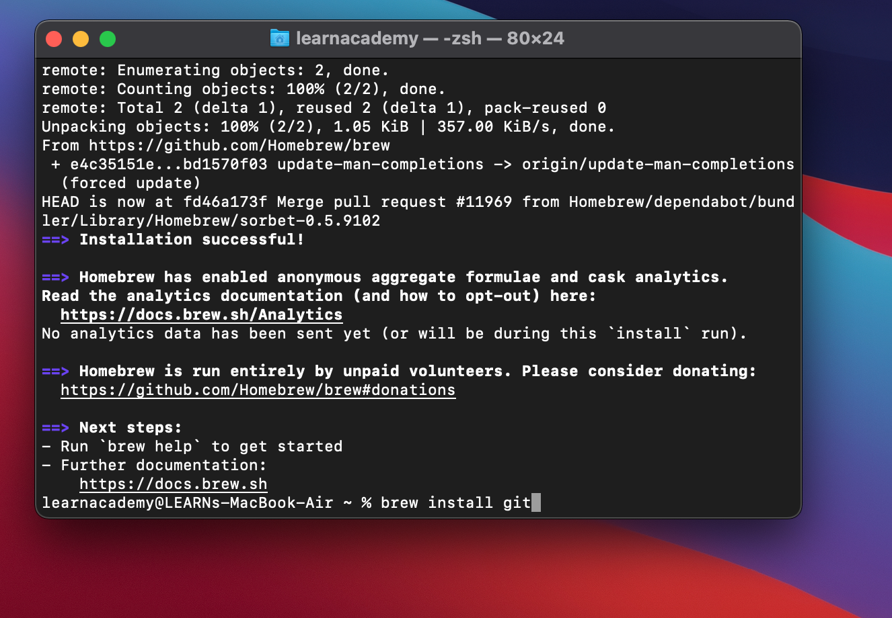

- When the command is finished it will look like this:

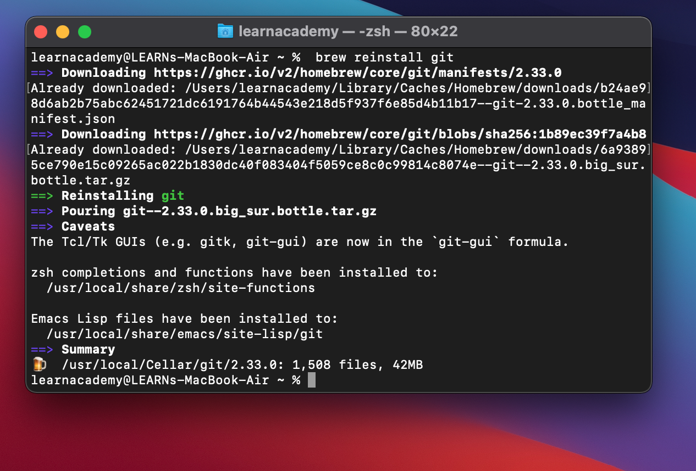

---
### Step 4: Clone the Provision Repo
- Type `git clone https://github.com/LEARNAcademy/provision.git` in the terminal
- Hit return

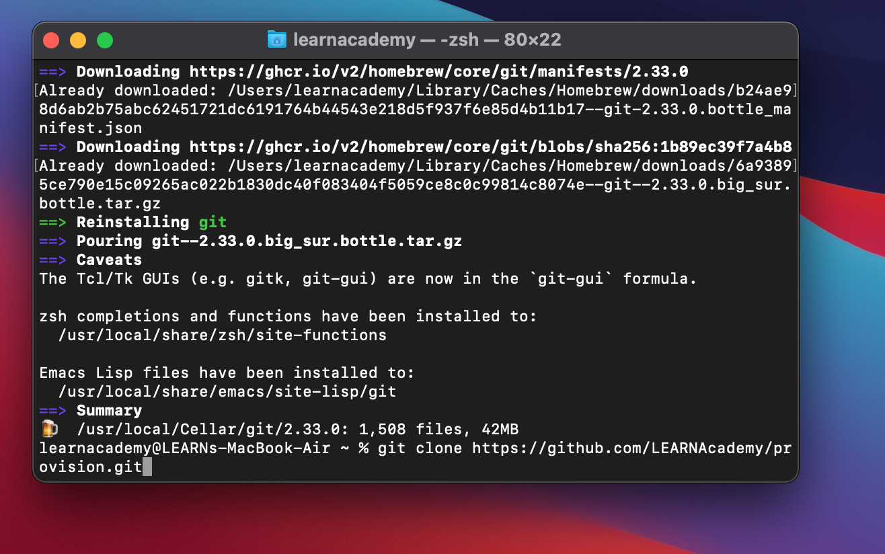

- When this command is finished it will look like this:

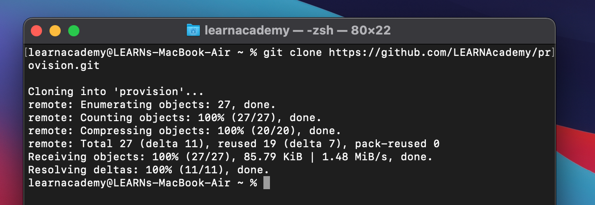

---
### Step 5: Install Apps and Technologies
- Type `brew bundle --file ~/provision/Brewfile` in the terminal
- Hit return

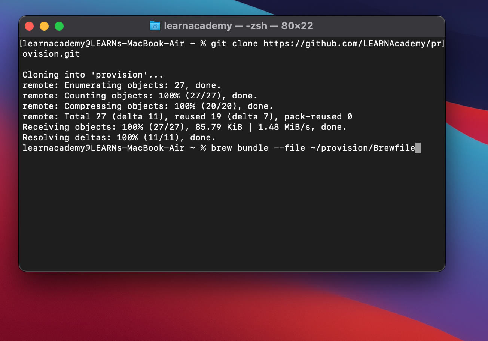

- This command will take about 20 min to install
  - Sometimes it will look like the computer is not doing anything, that is okay!
- This command will ask for your computer password about halfway through
  - When you type your password **no characters will appear**, but the keystrokes will be logged
- This command will install:
  - Google Chrome
  - Slack
  - Atom
  - VS Code
  - Zoom
  - As well as a handful of other apps and technology we will use in class

### DONE!
